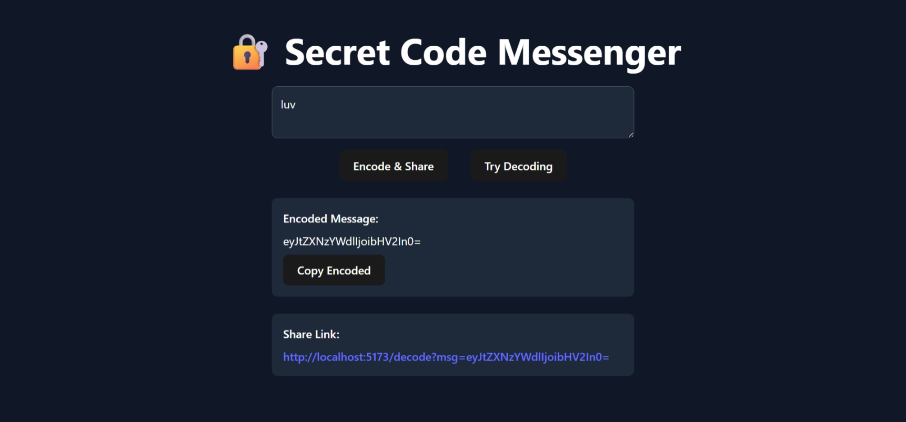
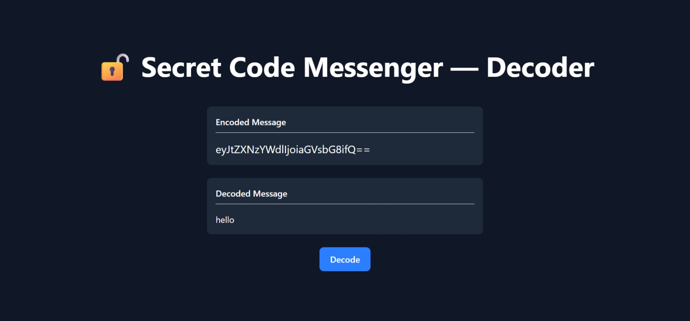

<div id="readme-top" align="center">

  <h1>Secret Code Messenger</h1>

  <p>A secure web application for encrypting and sharing messages.</p>

</div>

<br />


<!-- Table of Contents -->
# :notebook_with_decorative_cover: Table of Contents <!-- omit in toc -->

- [:star2: About the Project](#star2-about-the-project)
  - [:camera: Screenshots](#camera-screenshots)
  - [:space_invader: Tech Stack](#space_invader-tech-stack)
  - [:dart: Features](#dart-features)
- [:toolbox: Getting Started](#toolbox-getting-started)
  - [:bangbang: Prerequisites](#bangbang-prerequisites)
  - [:key: Environment Variables](#key-environment-variables)
  - [:gear: Installation](#gear-installation)
  - [:running: Run Locally](#running-run-locally)
- [:compass: Roadmap](#compass-roadmap)
- [:wave: Contributing](#wave-contributing)
- [:grey_question: FAQ](#grey_question-faq)
- [:warning: License](#warning-license)
- [:gem: Acknowledgements](#gem-acknowledgements)


<!-- About the Project -->
## :star2: About the Project
Secret Code Messenger is a secure web application that allows users to encrypt messages into ciphertext and share them through unique URLs for instant decoding. It ensures private communication by converting plain text into encrypted code, which can be easily decrypted either automatically when visiting a shared link or manually through the decode page.


<!-- Screenshots -->
### :camera: Screenshots

<div align="center" style="margin-bottom: 80px;">
  <div style="margin-bottom: 40px;">
    <h3>Encoding Page</h3>
    
  </div>
</div>
<div align="center" style="margin-bottom: 80px;">
  <div style="margin-bottom: 40px;">
    <h3>Decoding Page</h3>
    
  </div>
</div>


<!-- TechStack -->
### :space_invader: Tech Stack

* [![React][React.js]][React-url]
* [![Vite][Vite.js]][Vite-url]
* [![Tailwind][Tailwind.css]][Tailwind-url]
* [![Java][Java.com]][Java-url]
* [![Spring Boot][SpringBoot.io]][SpringBoot-url]
* [![MongoDB][MongoDB.com]][MongoDB-url]
  

<!-- Features -->
### :dart: Features

- 🔒 Encrypts messages securely using a custom CipherService.
- 🧩 Generates unique ciphertext for every encoded message.
- 🔗 Allows sharing encrypted messages through unique URLs for instant decoding.
- ⚡ Automatically decodes messages when accessing a shared link.
- ✍️ Provides a manual input option to decode ciphertext directly.
- 💬 Simple and intuitive UI for seamless message encoding and decoding.
- 🌐 Fast and responsive frontend with smooth backend integration.
- 🗄️ Secure backend storage and message handling.


<!-- Getting Started -->
## 	:toolbox: Getting Started

<!-- Prerequisites -->
### :bangbang: Prerequisites

- Node.js
- Git
- Java JDK 17+
- Maven
- MongoDB


<!-- Env Variables -->
### :key: Environment Variables

To run this project, you will need to add the following environment variables to your `./backend/src/main/resources/application.properties` file

```properties
spring.data.mongodb.uri=mongodb://localhost:27017/secretmessenger
server.port=8080
```


<!-- Installation -->
### :gear: Installation

1. Clone the repo
```bash
  git clone <repo_link>
```

2. Install packages for frontend
```bash
  cd frontend
  npm install
```

<!-- Run Locally -->
### :running: Run Locally

1. **Frontend:** Navigate to the project's frontend directory and start the Vite development server
```bash
  cd frontend
  npm run dev
```

2. **Backend:** Open another terminal and navigate to the project's backend directory and start the Spring Boot server
```bash
  cd backend
  mvn spring-boot:run
```

3. Open your browser and go to `http://localhost:5173` to access the application.


<!-- ROADMAP -->
## :compass: Roadmap

- [x] Add auto-decoding functionality via shared URLs
- [x] Create a responsive and minimal UI for encoding/decoding
- [x] Implement error handling for invalid or empty ciphertexts
- [ ] Add user authentication for private message access
- [ ] Implement message expiration or timed deletion
- [ ] Add dark/light theme toggle
- [ ] Deploy application to a cloud platform
- [ ] Integrate with a custom domain


<!-- CONTRIBUTING -->
## :wave: Contributing

Contributions are what make the open source community such an amazing place to learn, inspire, and create. Any contributions you make are **greatly appreciated**.

If you have a suggestion that would make this better, please fork the repo and create a pull request. You can also simply open an issue with the tag "enhancement".
Don't forget to give the project a star! Thanks again!

1. Fork the Project
2. Create your Feature Branch (`git checkout -b feature/AmazingFeature`)
3. Commit your Changes (`git commit -m 'Add some AmazingFeature'`)
4. Push to the Branch (`git push origin feature/AmazingFeature`)
5. Open a Pull Request


<!-- FAQ -->
## :grey_question: FAQ


<details>
  <summary>How does Secret Code Messenger work?</summary>

  When a user enters a message, it’s encrypted using a custom CipherService and converted into ciphertext.  
  This ciphertext can then be shared directly or through a unique URL, which automatically decodes the message when opened.
</details>
    
<details>
  <summary>Can I decode a message without a shared link?</summary>

  Yes. You can manually visit the **/decode** page and paste the ciphertext into the input field to reveal the original message.
</details>

<details>
  <summary>Is my message stored in the database?</summary>

  Currently, messages are not permanently stored. The system only handles encryption and decryption for transmission and display purposes.
</details>

<details>
  <summary>Can anyone access my decoded message?</summary>

  Only users with the correct ciphertext or link can view the decoded message — ensuring privacy and confidentiality.
</details>

<details>
  <summary>Will this work after deployment?</summary>

  Absolutely. Once the frontend and backend are deployed and connected properly, encryption, decoding, and URL-based sharing will work seamlessly on any device.
</details>


<!-- License -->
## :warning: License

Distributed under the no License.


<!-- Acknowledgments -->
## :gem: Acknowledgements

 - [Tailwind CSS Documentation](https://tailwindcss.com/docs/installation) for styling guidance
 - [Vite Documentation](https://vitejs.dev/guide/) for frontend setup
 - [Spring Boot Documentation](https://spring.io/projects/spring-boot) for backend framework
 - [MongoDB Documentation](https://docs.mongodb.com/) for database integration
 - [MongoDB Compass](https://www.mongodb.com/products/compass) for database management
 - [ChatGPT](https://chat.openai.com/) for brainstorming and code assistance
 - [Awesome README](https://github.com/matiassingers/awesome-readme)
 - [Emoji Cheat Sheet](https://github.com/ikatyang/emoji-cheat-sheet/blob/master/README.md#travel--places)


<p align="right">(<a href="#readme-top">back to top</a>)</p>


[React.js]: https://img.shields.io/badge/React-20232A?style=for-the-badge&logo=react&logoColor=61DAFB
[React-url]: https://react.dev/

[Vite.js]: https://img.shields.io/badge/Vite-646CFF?style=for-the-badge&logo=vite&logoColor=FFD62E
[Vite-url]: https://vitejs.dev/

[Tailwind.css]: https://img.shields.io/badge/Tailwind_CSS-0F172A?style=for-the-badge&logo=tailwindcss&logoColor=38BDF8
[Tailwind-url]: https://tailwindcss.com/

[SpringBoot.io]: https://img.shields.io/badge/Spring_Boot-6DB33F?style=for-the-badge&logo=springboot&logoColor=white
[SpringBoot-url]: https://spring.io/projects/spring-boot

[MongoDB.com]: https://img.shields.io/badge/MongoDB-001E2B?style=for-the-badge&logo=mongodb&logoColor=00ED64
[MongoDB-url]: https://www.mongodb.com/

[Java.com]: https://img.shields.io/badge/Java-ED8B00?style=for-the-badge&logo=openjdk&logoColor=white
[Java-url]: https://www.java.com/